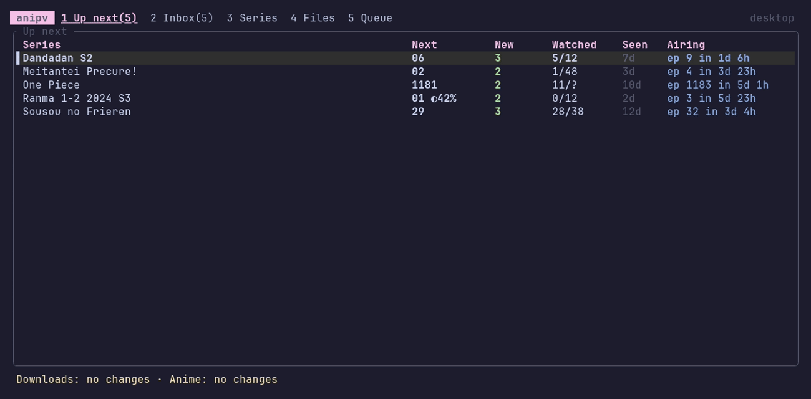
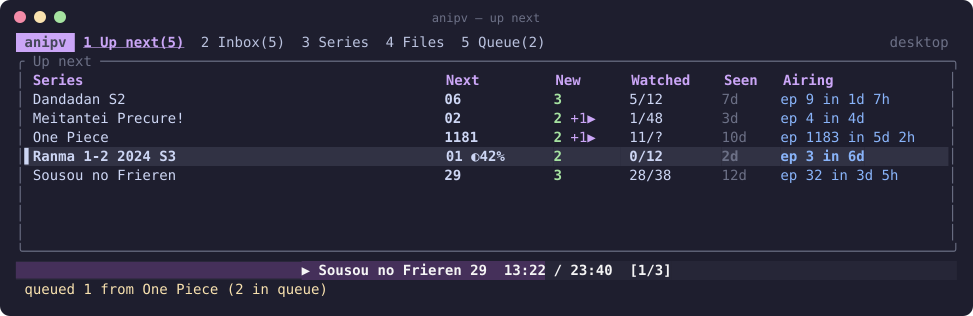
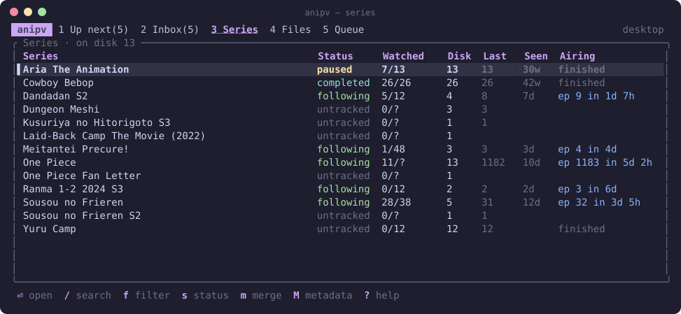
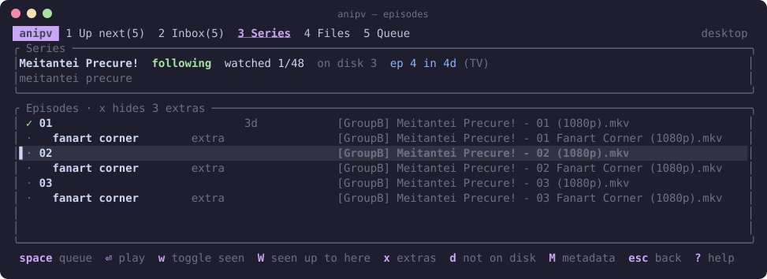
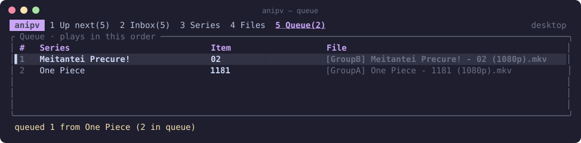
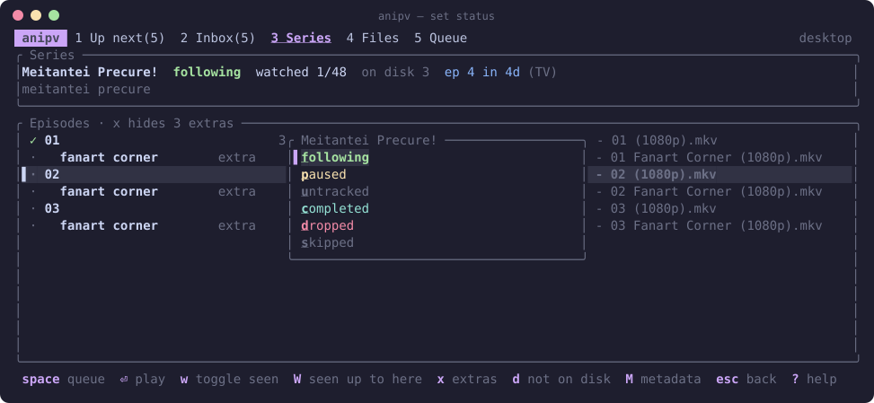
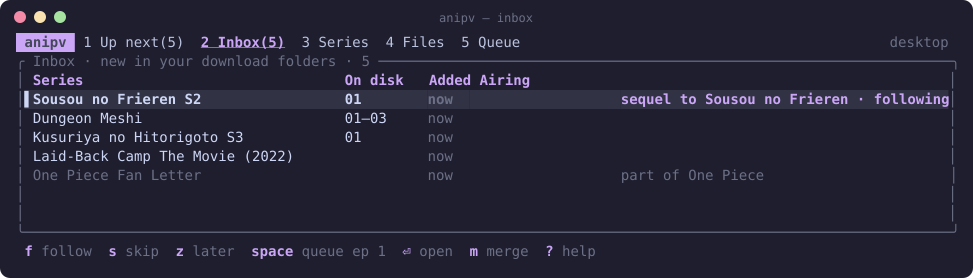
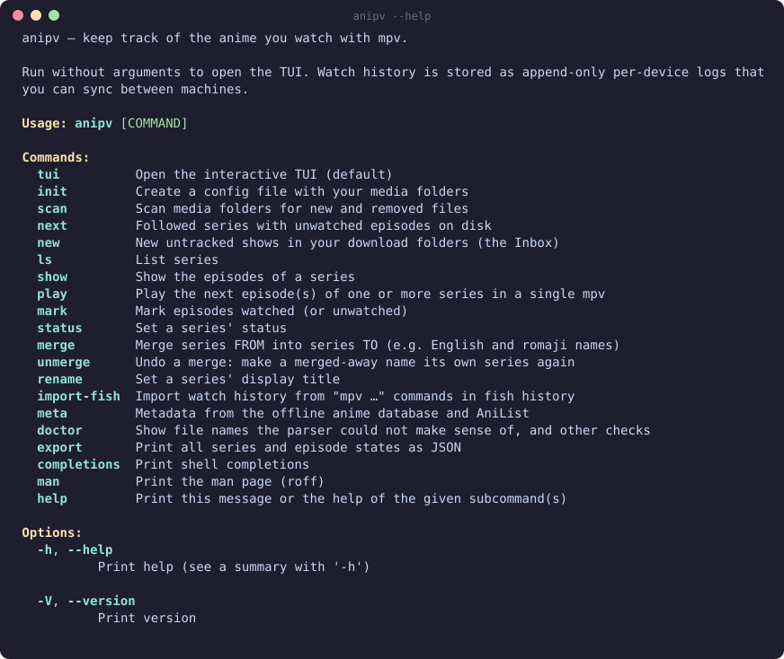

<h1 align="center">anipv</h1>

<p align="center">
  <b>Keep track of the anime you watch with mpv: what's new, what's next, what you dropped.</b><br>
  A terminal UI that indexes your anime folders, launches <code>mpv</code> for you and remembers how far you got.
</p>

<p align="center">
  <a href="https://github.com/kazie/anipv/actions/workflows/ci.yml"></a>
  
</p>

<p align="center"></p>

You keep anime in a downloads folder and an archive. You play episodes with
`mpv A.mkv B.mkv …`, and your memory of where you were lives in your shell
history. anipv replaces that:

- **Up next**: every series you follow, with the next unwatched episode on disk, how many new ones arrived, and when the next one airs.
- **Inbox**: new shows that appear in your download folder, newest first, with a new season of something you watch at the top. Follow (`f`), skip (`s`) or leave it for later (`z`).
- **Queue & play**: mark episodes from several shows, press `p`, and they play in one mpv session, just like `mpv A B C`.
- **Automatic tracking**: anipv follows mpv over its IPC socket. Finished episodes are marked watched; stop half-way and it resumes there next time.
- **Your library, understood**: bracketed (`[Group] Show - 07 (1080p)`), dotted (`Show.S01E07.1080p…`), underscored and numbered file names, `v2` versions, `S02E01` / `1x05` markers, season folders (inside an archive series folder, `Season 1` and `Season 2` stay separate seasons of the same title), OVAs, openings/endings, previews, multi-episode files. Parsed and grouped, with a test corpus covering each naming convention.
- **Statuses**: following, paused ("dropped too early, might resume"), dropped (with a note), completed, skipped. A status you set on a series you've already finished stays, so you can follow it again for a rewatch.
- **Local first, multi-device**: history is an append-only log per device. Sync the folder however you like; merging is conflict-free.
- **Optional metadata**: episode totals and airing dates from the offline [anime-offline-database] and anonymous [AniList] queries. No account needed, and nothing about your watching leaves your machine.
- **Bootstrap from fish**: imports the `mpv …` commands already in your fish history.

## Install

There are no prebuilt binaries; build it yourself (Rust 1.89+). anipv is
Unix-only (mpv is controlled over a Unix socket, so Windows isn't supported)
and is developed and tested on Linux.

```sh
git clone https://github.com/kazie/anipv && cd anipv
just install    # release build, installed as ~/.cargo/bin/anipv
```

Make sure `~/.cargo/bin` is on your `PATH`. [`just`](https://github.com/casey/just)
runs `cargo install --path . --locked`, which always builds in release mode.
Without `just`, run that command yourself (add `--root ~` to install as
`~/bin/anipv` instead), or skip the checkout:

```sh
cargo install --git https://github.com/kazie/anipv --locked
```

Re-run it after `git pull` to update.

Needs [`mpv`](https://mpv.io) on your `PATH`. fish is only needed for
`import-fish`. Shell completions and a man page:
`anipv completions fish > ~/.config/fish/completions/anipv.fish`, `anipv man > anipv.1`.

## Quick start

```sh
# 1. Tell anipv where your anime lives.
#    ongoing = loose files, series from file names
#    archive = one folder per series
anipv init --ongoing ~/media/Downloads --archive ~/media/Anime
#    (config goes to ~/.config/anipv/config.toml, history to
#    ~/.local/share/anipv/events; add --events-dir <synced folder> to share history)

# 2. Index it (also happens in the background every time the TUI starts).
anipv scan

# 3. Optional: import what you've already watched from fish history.
anipv import-fish --dry-run        # look first
anipv import-fish --apply-status   # mark watched + follow recent shows

# 4. Optional: episode totals and airing times
#    (or press ctrl-r in the TUI, which downloads the anime database for you).
anipv meta refresh --all

# 5. Go.
anipv
```

Just want to look around? `anipv demo /tmp/anipv-demo && ANIPV_HOME=/tmp/anipv-demo anipv`
opens a fake library.

## The TUI

<p align="center"></p>

**Up next**: what to watch next in every series you follow.

| | |
| --- | --- |
|  |  |
| **Series**: everything on disk, filterable by status and fuzzy-searchable. Merge different names of the same show (`m`). | **Episodes**: watched ✓, started ◐; extras tucked under their episode (`x`). Episodes no longer on disk stay out of the way until `d`. |
|  |  |
| **Queue**: reorder with `J`/`K`, play with `p`, or `y` to copy the plain `mpv …` command. | **Status**: `s`, then a letter. Dropping or pausing asks for an optional note. |

<p align="center"></p>

**Inbox**: everything new in your download folder that you haven't decided on yet. A new season of something you watch is flagged and sorted first (by title, and by AniList's prequel links); specials of other shows go last.

Common keys: `1`–`5` switch views, `space` queues, `p` plays, `s` sets the
status, `/` searches, `M` refreshes metadata for the series under the cursor,
`ctrl-r` refreshes all of it, `q` or `ctrl-c` quits (after asking), `?` shows everything. Full list: [docs/keybindings.md](docs/keybindings.md).

## The CLI

Everything the TUI does is also scriptable:

<p align="center"></p>

```sh
anipv next                            # what's new for followed series
anipv play "one piece" frieren -n 2   # next 2 episodes of each, one mpv, tracked
anipv play frieren --print            # just print the mpv command
anipv mark "grand blue" 1-12          # mark watched
anipv status "k-on" dropped --note "not for me"
anipv merge "even the student council" "seitokai ni mo ana"
anipv show frieren
anipv export | jq '.[] | select(.status=="following") | .title'
```

## How it works

```
media folders ──scan──▶ index (SQLite cache)      events/<device>.jsonl  ◀── your history
                                 └──────── library ◀─────── replay ┘
                                              │
                                     TUI / CLI ──▶ mpv ──IPC──▶ watched / progress events
```

- **Nothing is keyed on file paths.** History is stored per *series* and *episode*
  (`one piece`, ep `1180`), so moving files from Downloads to the archive, a
  differently named copy or another mount point on your laptop doesn't matter.
- **Archive roots**: the top-level folder names the series; a season 2 or later
  (an `S02E01` marker, or a `Season 2` / `S02` folder below it) becomes its own
  series of that title (`show s2`). Download roots take the series from file
  names. See [docs/config.md](docs/config.md#roots).
- **The event log is the only thing that matters.** The index and metadata are a
  cache you can delete. See [docs/events.md](docs/events.md) for the format.
- **Syncing between machines**: point `events_dir` at a synced folder (Syncthing,
  Nextcloud, git…). Each machine writes only its own file, so there are no conflicts.

### Privacy

anipv makes two kinds of network requests, both optional:

1. `anipv meta update` downloads the public [anime-offline-database] JSON from GitHub.
2. For series you *follow*, it asks [AniList]'s public API about the anime by id
   (`next airing episode`, `episode count`). No account or token is involved, and
   nothing is ever sent about what you watched. Set `anilist = false` to turn it off.

More: [configuration](docs/config.md) · [architecture](docs/architecture.md) · [event log](docs/events.md) · [keys](docs/keybindings.md)

## Development

The [`justfile`](justfile) collects the usual commands; `just --list` shows them all.
[just](https://github.com/casey/just) is optional: every recipe is a plain cargo
command you can copy from the `justfile`.

```sh
just check            # fmt, clippy, tests, docs and cargo-deny (needs cargo-deny)
just ci               # check, then the MSRV build (Rust 1.89): the local version of CI
just demo             # try the TUI against a throwaway demo library
just screenshots      # regenerate the SVGs in this README
just record           # re-record the demo GIF (needs vhs and ttyd)
just update-fixtures  # update golden files after an intentional change, then review
just install          # install a release build to ~/.cargo/bin
```

- Tests are unit, property, snapshot and end-to-end tests (`cargo test`). After an
  intentional UI change, review snapshots with `cargo insta review`.
- The parser is tested against `tests/fixtures/filenames.tsv`, one example per naming convention.
  After an intentional parser change: `UPDATE_FIXTURES=1 cargo test --test parser_corpus`
  and review the diff.
- `anipv doctor` lists files in your own library that parse without an episode
  number. Good candidates for new fixtures.
- CI runs fmt, clippy, tests on stable and MSRV, docs and `cargo-deny`.
  Dependabot keeps crates and actions current.

[anime-offline-database]: https://github.com/manami-project/anime-offline-database
[AniList]: https://anilist.co
